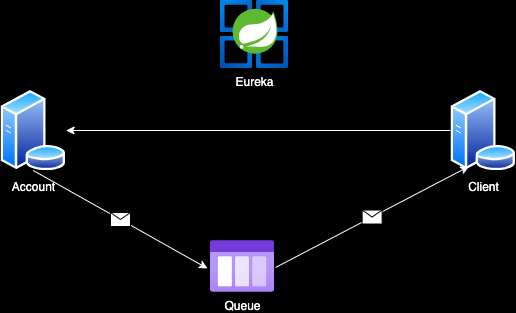

# Architecture



# Running Docker Compose for Microservices

This project uses Docker Compose to run RabbitMQ and a Eureka Server for microservices communication and service discovery.

## Prerequisites

Before running Docker Compose, ensure you have Docker installed on your machine. You can download Docker from [here](https://www.docker.com/get-started).

## Getting Started

1. Clone this repository to your local machine:

   ```bash
   git clone https://github.com/galopulerev/microservices.git
   
2. Navigate to the project directory:

    ```bash
   cd microservices
   
3. Navigate to `docker` folder

    ```bash
   cd docker

## Running Docker Compose
To start the containers using Docker Compose:
```bash
    docker compose up
```

This command will build and start the RabbitMQ and Eureka Server containers as well as the microservices. You will see the container logs in the terminal.

To run the containers in detached mode (background), use:
```bash
    docker compose up -d
```
## Accessing Services
* RabbitMQ:
  * Web UI: http://localhost:15672
  * AMQP port: localhost:5672
* Eureka Server:
  * Dashboard: http://localhost:8761
* Client Service:
  * API: http://localhost:8080/clientes
* Account Service:
  * API: http://localhost:8080/cuentas
  * API: http://localhost:8080/movimientos


## Stopping Docker Compose
To stop and remove the containers created by Docker Compose:
```bash
    docker compose down
```